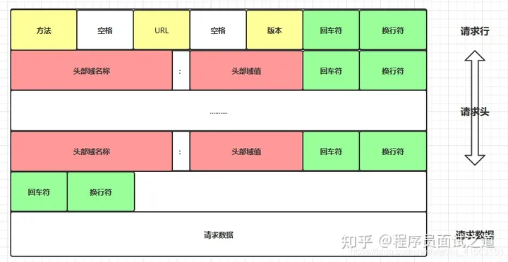
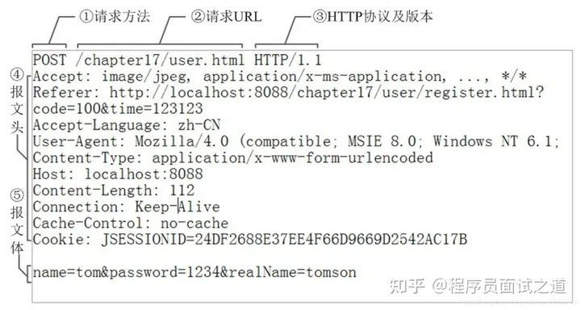
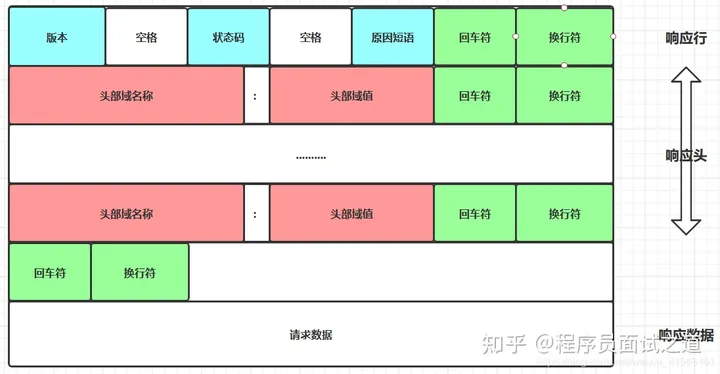
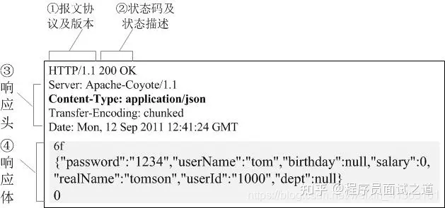

http连接处理类
===============
根据状态转移,通过主从状态机封装了http连接类。其中,主状态机在内部调用从状态机,从状态机将处理状态和数据传给主状态机
> * 客户端发出http连接请求
> * 从状态机读取数据,更新自身状态和接收数据,传给主状态机
> * 主状态机根据从状态机状态,更新自身状态,决定响应请求还是继续读取

在 HTTP 协议中，换行符 \r\n 用于标识一行的结束

## 请求报文
HTTP的请求报文由四部分组成（请求行+请求头部+空行+请求体）：

真实数据

①是请求方法，GET和POST是最常见的HTTP方法，除此以外还包括DELETE、HEAD、OPTIONS、PUT、TRACE。不过，当前的大多数浏览器只支持GET和POST，Spring 3.0提供了一个HiddenHttpMethodFilter，允许你通过“_method”的表单参数指定这些特殊的HTTP方法（实际上还是通过POST提交表单）。服务端配置了HiddenHttpMethodFilter后，Spring会根据_method参数指定的值模拟出相应的HTTP方法，这样，就可以使用这些HTTP方法对处理方法进行映射了。

②为请求对应的URL地址，它和报文头的Host属性组成完整的请求URL，

③是协议名称及版本号。

④是HTTP的报文头 ，报文头包含若干个属性，格式为“属性名:属性值”，服务端据此获取客户端的信息。

Client-IP：提供了运行客户端的机器的IP地址
From：提供了客户端用户的E-mail地址
Host：给出了接收请求的服务器的主机名和端口号
Referer：提供了包含当前请求URI的文档的URL
UA-Color：提供了与客户端显示器的显示颜色有关的信息
UA-CPU：给出了客户端CPU的类型或制造商
UA-OS：给出了运行在客户端机器上的操作系统名称及版本
User-Agent：将发起请求的应用程序名称告知服务器
Accept：告诉服务器能够发送哪些媒体类型
Accept-Charset：告诉服务器能够发送哪些字符集
Accept-Encoding：告诉服务器能够发送哪些编码方式
Accept-Language：告诉服务器能够发送哪些语言
TE：告诉服务器可以使用那些扩展传输编码
Expect：允许客户端列出某请求所要求的服务器行为
Range：如果服务器支持范围请求，就请求资源的指定范围
Cookie：客户端用它向服务器传送数据
Cookie2：用来说明请求端支持的cookie版本

⑤是报文体，它将一个页面表单中的组件值通过param1=value1¶m2=value2的键值对形式编码成一个格式化串，它承载多个请求参数的数据。不但报文体可以传递请求参数，请求URL也可以通过类似于“/chapter15/user.html? param1=value1¶m2=value2”的方式传递请求参数。

## 响应报文
HTTP的响应报文也由四部分组成（ 响应行+响应头+空行+响应体）：

真实数据

①报文协议及版本；

②状态码及状态描述；
状态码详解https://mp.weixin.qq.com/s/xxxS5qG244F6L10Y_ZxyGQ

③响应报文头，也是由多个属性组成；
Age：(从最初创建开始)响应持续时间
Public：服务器为其资源支持的请求方法列表
Retry-After：如果资源不可用的话，在此日期或时间重试
Server：服务器应用程序软件的名称和版本
Title：对HTML文档来说，就是HTML文档的源端给出的标题
Warning：比原因短语更详细一些的警告报文
Accept-Ranges：对此资源来说，服务器可接受的范围类型
Vary：服务器会根据这些首部的内容挑选出最适合的资源版本发送给客户端
Proxy-Authenticate：来自代理的对客户端的质询列表
Set-Cookie：在客户端设置数据，以便服务器对客户端进行标识
Set-Cookie2：与Set-Cookie类似
WWW-Authenticate：来自服务器的对客户端的质询列表

④响应报文体，即我们真正要的“干货”。

